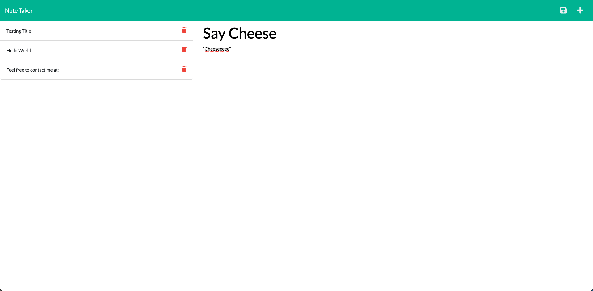

# Express Note Taker
[Link to Application](https://express-note-taker-by-dn.herokuapp.com/)

## Description
This is a node based application where the user can create, save, review, and/or delete notes. The notes are saved on a backend server so the user has access to their notes from any internet connected device.

## User Story

```
AS A small business owner
I WANT to be able to write and save notes
SO THAT I can organize my thoughts and keep track of tasks I need to complete
```


## Acceptance Criteria

```
GIVEN a note-taking application
WHEN I open the Note Taker
THEN I am presented with a landing page with a link to a notes page
WHEN I click on the link to the notes page
THEN I am presented with a page with existing notes listed in the left-hand column, plus empty fields to enter a new note title and the note’s text in the right-hand column
WHEN I enter a new note title and the note’s text
THEN a Save icon appears in the navigation at the top of the page
WHEN I click on the Save icon
THEN the new note I have entered is saved and appears in the left-hand column with the other existing notes
WHEN I click on an existing note in the list in the left-hand column
THEN that note appears in the right-hand column
WHEN I click on the Write icon in the navigation at the top of the page
THEN I am presented with empty fields to enter a new note title and the note’s text in the right-hand column
```
## Image

## Usage
- Go to [deployed application](https://express-note-taker-by-dn.herokuapp.com/)
- Click 'get started'
- Type in your note title and description
    - Once you type in a description, a save icon will automatically appear for you to click
- The '+' in the upper right allows you to create a new note
- Clicking the red 'trash' icon will delete the note
